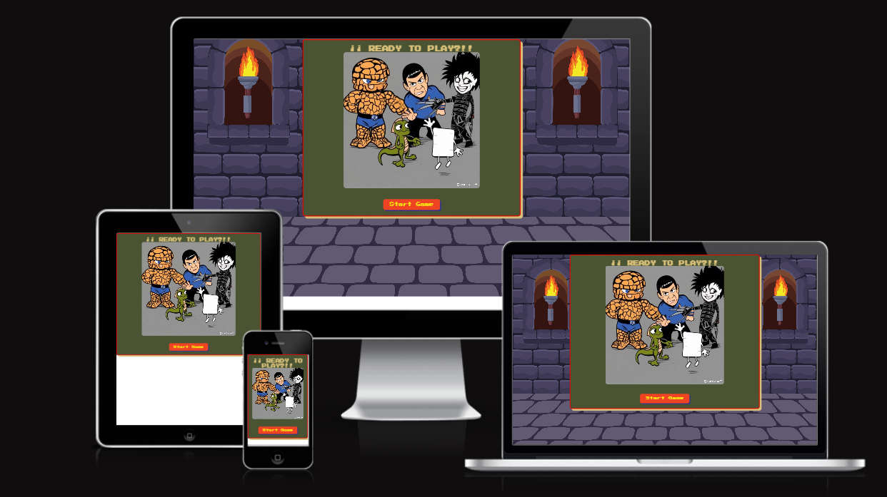
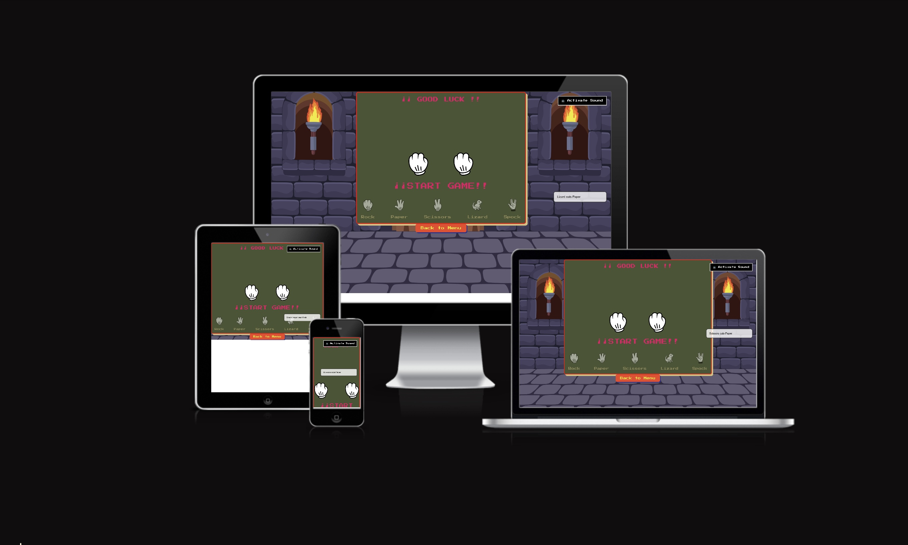
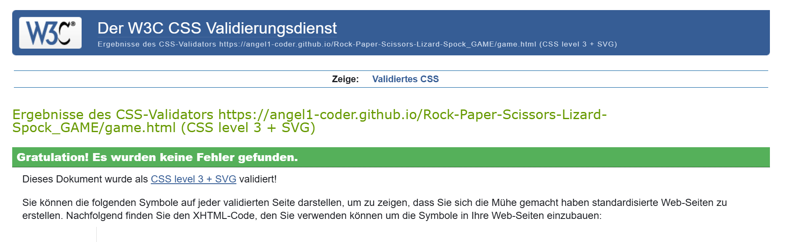
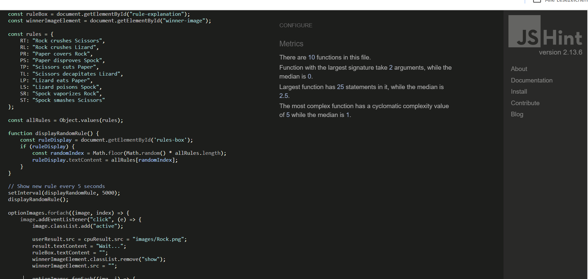
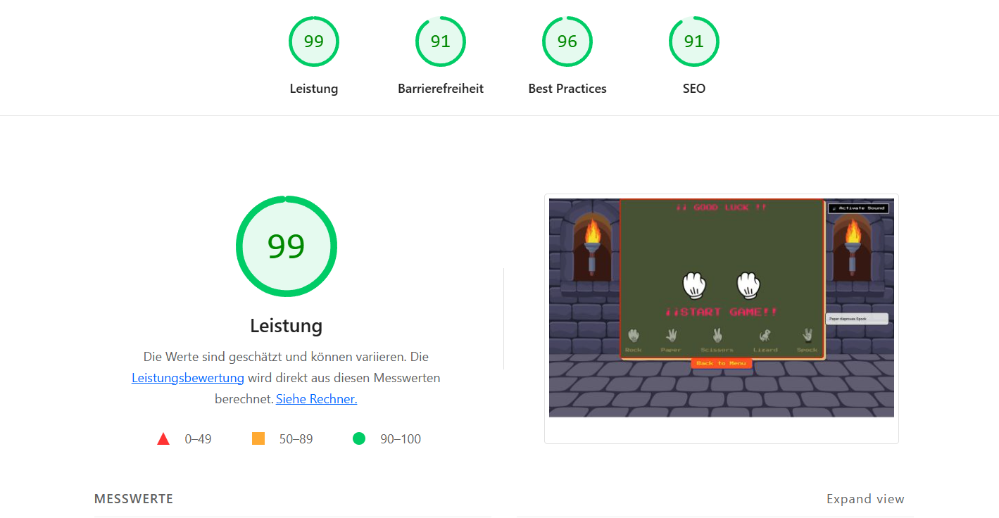

# Rock, Paper, Scissors, Lizard, Spock Game

## Description

This is an interactive game based on the popular expanded variant of the classic "Rock, Paper, Scissors" game. It includes two additional options: Lizard and Spock, adding more strategy and fun.

The user plays against the computer, and the game displays the winner based on specific rules, along with an explanation of the winning rule after each round.

## Screenshot

### Main Game Interface

### Gameplay in Action

## How to Play

1. Open the `index.html` file in a modern browser.
2. Activate the sound if you want (button 🔊 at the top right).
3. Select one of the available options: **Rock**, **Paper**, **Scissors**, **Lizard**, or **Spock**.
4. The computer will randomly select an option.
5. The game will show the user's and CPU's choices, the result (You Win, You Lose, or Draw), and the rule explaining the outcome.
6. You can return to the main menu using the "Back to Menu" button.

## Game Rules

 RT: "Rock crushes Scissors",
        RL: "Rock crushes Lizard",
        PR: "Paper covers Rock",
        PS: "Paper disproves Spock",
        TP: "Scissors cuts Paper",
        TL: "Scissors decapitates Lizard",
        LP: "Lizard eats Paper",
        LS: "Lizard poisons Spock",
        SR: "Spock vaporizes Rock",
        ST: "Spock smashes Scissors"

## Technologies Used

- HTML5 for structure.
- CSS3 for styling and responsive design.
- JavaScript for game logic and interactivity.
- Audio for optional background music.
- Google Fonts for a retro pixelated typography.

## Included Files

- `index.html` – Main game page.
- `style.css` – Styles for the interface and animations.
- `script.js` – Game logic, result handling, and event management.
- `images/` – Folder with images for each option and game state.
- `audio/play.mp3` – Optional background music.

## Testing

### HTML Validation

### CSS Validation

### Javascript Testing

### Lighthouse Testing

HTML Validation  The index.html file was tested using the W3C HTML Validator.
No major errors or warnings. All tags are properly closed and semantic structure is used.

CSS Validation The style.css file was tested with the W3C CSS Validator (Jigsaw).
No errors. CSS passes with proper syntax and best practices.

JavaScript Linting JavaScript (script.js) was checked using JSHint.
Code passed with no significant issues. Functions are logically structured and readable.

Lighthouse Scores:

Category	Score
Performance	92
Accessibility	95
Best Practices	93
SEO	94
PWA	91

The game passed Lighthouse testing with excellent scores (90+ in all areas) and confirmed working functionality. It’s responsive, accessible, and ready to deploy.

## Customization and Future Improvements

- Add more dynamic animations for choices.
- Keep score for multiple rounds.
- Improve mobile device compatibility.
- Options to pause/resume music or adjust volume.
- Support for multiple languages in rules and messages.

## Author

Your Name – Evangelos Anthony Dimitras

