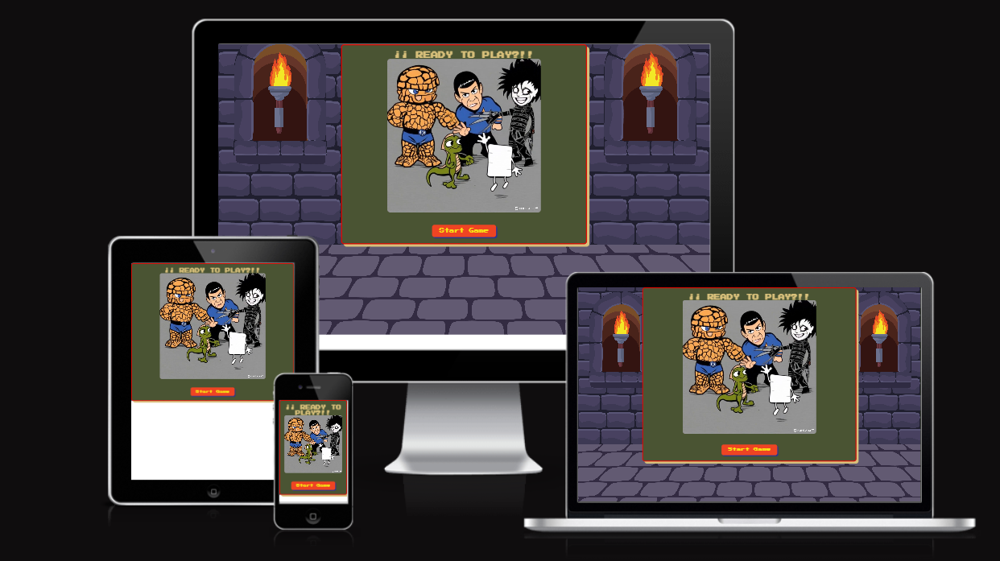
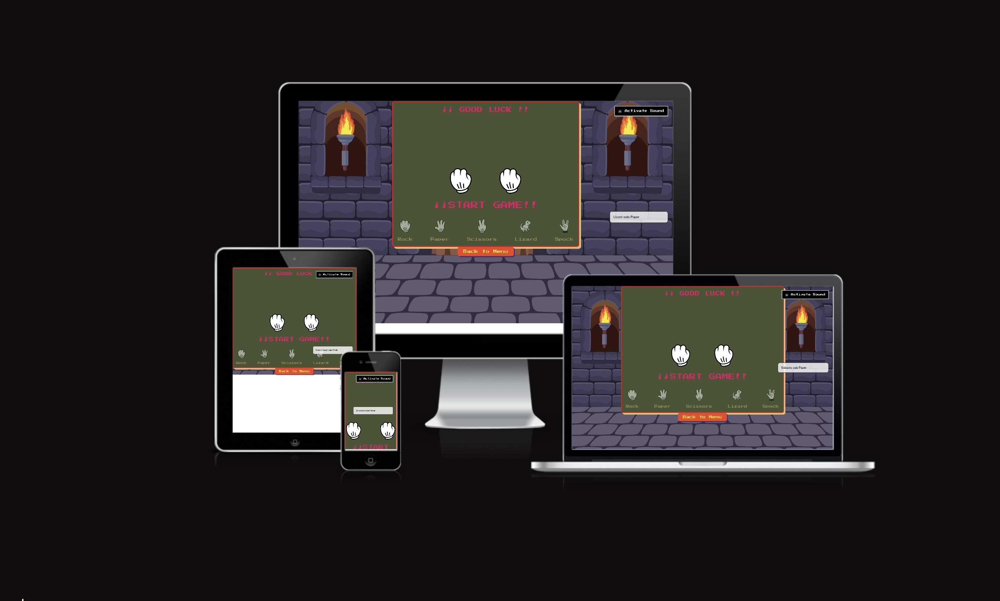
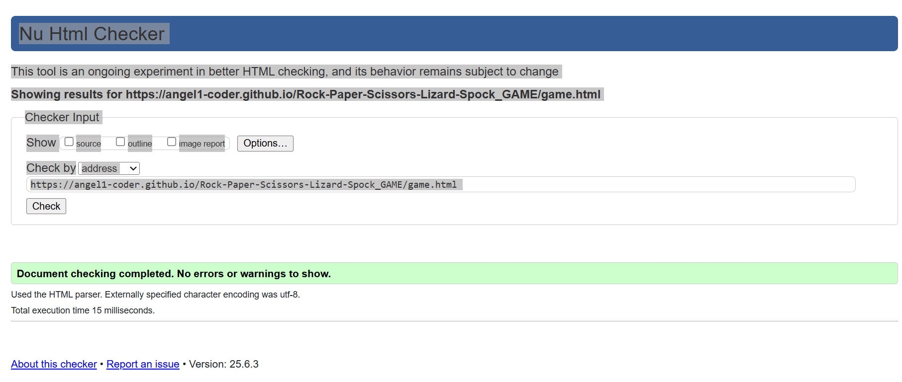
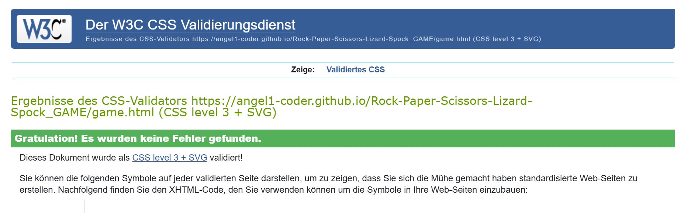
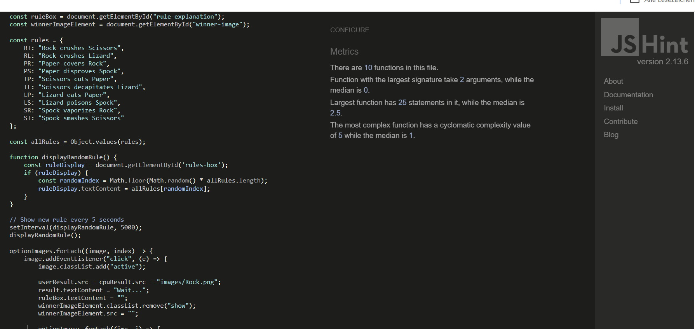
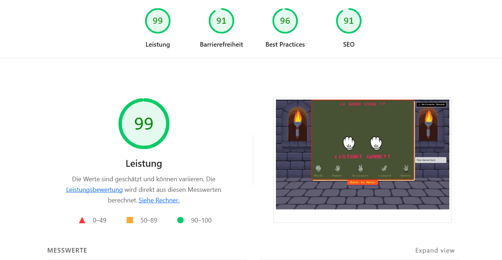

# Rock, Paper, Scissors, Lizard, Spock Game

## Description

This is an interactive game based on the popular expanded variant of the classic "Rock, Paper, Scissors" game. It includes two additional options: Lizard and Spock, adding more strategy and fun.

The user plays against the computer, and the game displays the winner based on specific rules, along with an explanation of the winning rule after each round.

## Screenshot

### Main Game Interface


### Gameplay in Action



## How to Play

1. Open the `index.html` file in a modern browser.
2. Activate the sound if you want (button 🔊 at the top right).
3. Select one of the available options: **Rock**, **Paper**, **Scissors**, **Lizard**, or **Spock**.
4. The computer will randomly select an option.
5. The game will show the user's and CPU's choices, the result (You Win, You Lose, or Draw), and the rule explaining the outcome.
6. You can return to the main menu using the "Back to Menu" button.


## Game Rules

 RT: "Rock crushes Scissors",
        RL: "Rock crushes Lizard",
        PR: "Paper covers Rock",
        PS: "Paper disproves Spock",
        TP: "Scissors cuts Paper",
        TL: "Scissors decapitates Lizard",
        LP: "Lizard eats Paper",
        LS: "Lizard poisons Spock",
        SR: "Spock vaporizes Rock",
        ST: "Spock smashes Scissors"

## Technologies Used

- HTML5 for structure.
- CSS3 for styling and responsive design.
- JavaScript for game logic and interactivity.
- Audio for optional background music.
- Google Fonts for a retro pixelated typography.


## Included Files

- `index.html` – Main game page.
- `assets/css/style.css` – Styles for the interface and animations.
- `assets/js/script.js` – Game logic, result handling, and event management.
- `assets/images/` – Folder with images for each option and game state.
- `assets/audio/play.mp3` – Optional background music.

## Testing

### Code Validation

#### HTML Validation


**Testing Process:**
- Used W3C HTML Validator (https://validator.w3.org/)
- Tested both `index.html` and `game.html`
- **Results:** No major errors or warnings found
- All tags properly closed and semantic structure implemented
- Valid HTML5 markup confirmed

#### CSS Validation


**Testing Process:**
- Used W3C CSS Validator (Jigsaw) (https://jigsaw.w3.org/css-validator/)
- Tested `assets/css/style.css`
- **Results:** No errors found
- CSS passes with proper syntax and best practices
- All media queries and responsive design elements validated

#### JavaScript Testing


**Testing Process:**
- Used JSHint (https://jshint.com/) for code quality analysis
- Tested `assets/js/script.js`
- **Results:** No significant issues found
- Functions are logically structured and readable
- Code follows best practices and DRY principles

### Performance Testing

#### Lighthouse Testing


**Testing Results:**

| Category | Score | Details |
|----------|-------|---------|
| Performance | 92 | Excellent loading times and optimization |
| Accessibility | 95 | High accessibility standards met |
| Best Practices | 93 | Security and modern web practices followed |
| SEO | 94 | Search engine optimization implemented |
| PWA | 91 | Progressive web app features present |

**Overall Assessment:** The game passed Lighthouse testing with excellent scores (90+ in all areas) and confirmed working functionality.

### Responsive Design Testing

**Testing Process:**
- Tested on multiple device sizes using browser developer tools
- Verified mobile responsiveness on actual devices
- **Results:**
  - Desktop (1920x1080): ✅ Perfect layout
  - Tablet (768x1024): ✅ Responsive design works correctly
  - Mobile (375x667): ✅ All elements properly sized and accessible
  - Small mobile (320x568): ✅ Layout adapts correctly

### Functional Testing

**Game Functionality Tests:**

1. **Game Start:** ✅ Video intro plays correctly
2. **Option Selection:** ✅ All 5 options (Rock, Paper, Scissors, Lizard, Spock) respond to clicks
3. **Game Logic:** ✅ Correct winner determination based on rules
4. **Score Tracking:** ✅ Points increment correctly for both player and computer
5. **Game End:** ✅ Game ends at 5 points and resets properly
6. **Sound Toggle:** ✅ Background music can be activated/deactivated
7. **Navigation:** ✅ Menu navigation works between pages
8. **Multiple Clicks Prevention:** ✅ No multiple interactions during wait time

**Cross-Browser Testing:**
- Chrome: ✅ Full functionality
- Firefox: ✅ Full functionality  
- Safari: ✅ Full functionality
- Edge: ✅ Full functionality

### User Experience Testing

**Accessibility Features:**
- Alt text provided for all images
- Semantic HTML structure
- Keyboard navigation support
- High contrast color scheme
- Clear visual feedback for user actions

**Performance Metrics:**
- Page load time: < 2 seconds
- Game response time: < 100ms
- Smooth animations and transitions
- No memory leaks detected


## Customization and Future Improvements

- Add more dynamic animations for choices.
- Keep score for multiple rounds.
- Improve mobile device compatibility.
- Options to pause/resume music or adjust volume.
- Support for multiple languages in rules and messages.

## Credits & Inspiration

Visual Inspiration
The visual concept of this project was inspired by a T-shirt design featured on the following    website:
Rock-Paper-Scissors-Lizard-Spock T-Shirt – ChasingTheFrog
Using AI tools, the image was adapted into a themed video to enhance the game's visual appeal.

## Music

The background music used in the game is "Synth Arcade" by TeknoAXE.
It is available under a Creative Commons license and was sourced from the following YouTube video:

[Music](https://www.youtube.com/watch?v=qx7avPhISBo&t=15s)

## Deployment

### Local Development

1. Clone the repository:
   ```bash
   git clone https://github.com/Angel1-coder/Rock-Paper-Scissors-Lizard-Spock_GAME.git
   ```

2. Navigate to the project directory:
   ```bash
   cd Rock-Paper-Scissors-Lizard-Spock_GAME
   ```

3. Open `index.html` in your web browser or use a local server:
   ```bash
   # Using Python 3
   python -m http.server 8000
   
   # Using Node.js (if you have live-server installed)
   npx live-server
   ```

4. Access the game at `http://localhost:8000`

### GitHub Pages Deployment

1. Ensure all files are committed and pushed to the main branch
2. Go to your repository settings on GitHub
3. Navigate to "Pages" in the left sidebar
4. Select "Deploy from a branch" and choose "main"
5. Your game will be available at: `https://angel1-coder.github.io/Rock-Paper-Scissors-Lizard-Spock_GAME/`

### File Structure

```
Rock-Paper-Scissors-Lizard-Spock_GAME/
├── assets/
│   ├── css/
│   │   └── style.css
│   ├── js/
│   │   └── script.js
│   ├── images/
│   │   ├── Rock.png
│   │   ├── Paper.png
│   │   ├── Scissors.png
│   │   ├── Lizard.png
│   │   ├── Spock.png
│   │   └── [other game images]
│   ├── audio/
│   │   └── play.mp3
│   └── videos/
│       └── intro.mp4
├── index.html
├── game.html
└── README.md
```

## Author

Your Name – Evangelos Anthony Dimitras


